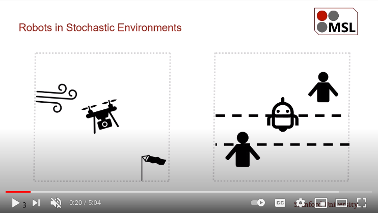

# RATiLQR.jl  [![Documentation][docs-dev-img]][docs-dev-url]

[docs-dev-img]: https://img.shields.io/badge/docs-dev-blue.svg
[docs-dev-url]: https://stanfordmsl.github.io/RATiLQR.jl/dev/

A Julia implementation of the RAT iLQR algorithm and relevant methods for nonlinear (stochastic) optimal control.
The following MPC algorithms are currently implemented:

- **Risk Auto-Tuning iLQR (RAT iLQR)**
- **RAT iLQR++**
- iterative Linear-Quadratic-Gaussian (iLQG)
- iterative Linear-Exponential-Quadratic-Gaussian (iLEQG)
- PETS

RAT iLQR is a distributionally robust nonlinear MPC via risk-sensitive optimal control. Originally presented in [our paper](https://arxiv.org/abs/2010.08174), it locally optimizes a bilevel optimization objective with iLEQG and the Cross Entropy Method. RAT iLQR++ solves the same optimization problem, but with the Nelder-Mead Simplex Method in place of the Cross Entropy Method and generally achieves better performance and faster optimization. iLQG, iLEQG, and PETS are for benchmarking purposes and do not possess the distributional robustness property.

**Important**
If you find this package useful for your research, please cite our publication:

    @article{nishimura2021ratilqr,
        author={H. {Nishimura} and N. {Mehr} and A. {Gaidon} and M. {Schwager}},
        journal={IEEE Robotics and Automation Letters}, 
        title={RAT iLQR: A Risk Auto-Tuning Controller to Optimally Account for Stochastic Model Mismatch}, 
        year={2021},
        doi={10.1109/LRA.2020.3048660}}

RAT iLQR Overview
-----------------

A brief overview is provided in our Youtube video:

Documentation
-------------

For more details, please read [the official documentation][docs-dev-url].

